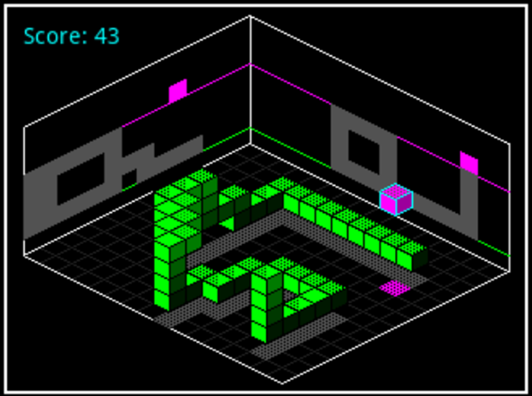
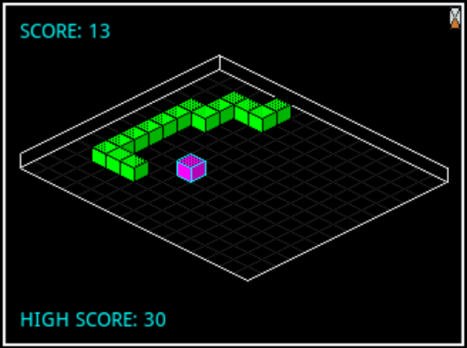
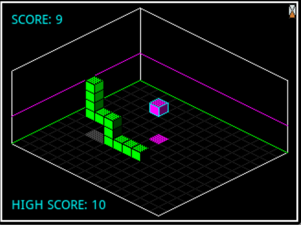
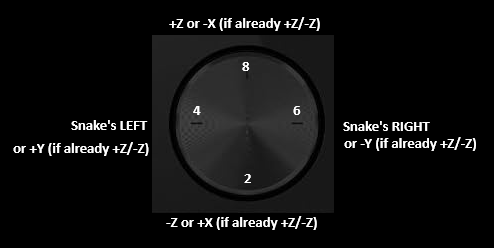

# SNAKE_3D_PRIME

An isometric 3D Snake for the HP Prime. I don't own the original Snake.

## Game modes

- **Classic**: This mode is essentially an isometric variant of the classic 2D Snake.

- **3D**: In this mode, an isometric 3D map is rendered. You must move through the 3D space to follow the target spawn locations.

## Controls

In 2D mode, the snake's direction is controlled by the Right and Left directional keys. The change in direction is always relative to the snake's head rather than the map; for example, tapping "Right" will rotate the head to its own right.

In 3D mode, the snake's direction is controlled by the Right and Left keys as in 2D mode, while Up and Down move the snake upward and downward.

In 3D mode, while facing upward or downward (along the positive/negative Z-axis), pressing Left or Right moves the snake along the X-axis. Similarly, pressing Up or Down while facing vertically will turn the snake to face along the Y-axis.

This may sound a bit quirky, and it is, but after a few tries, you will be able to navigate the 3D grid smoothly. I recommend starting with a lower game speed to practice these controls.

## User settings

At each launch, the user is prompted for several settings via pop-up menus:

- Game Mode: see above.

- Shadows: Sets the preference for shadows cast by the snake and its food. Their main purpose is to provide depth perception in the isometric space; I advise leaving at least the floor shadow enabled. In any case, two lines are projected onto the left and right walls to provide the minimal perception needed to play safely.

- Map Size: Sets the size of the 2D or 3D grid.  **Please note that the larger size may result in lower visual quality for game entities due to the limited screen resolution and higher grid density (entities become too small).**

- Game Speed: Sets the movement speed of the snake, which determines the difficulty level.

## How to run

Transfer the .hpprgm program file via the HP Connectivity Kit and launch it from the Programs section.

---

## Notes:
Since v1.1 - High score persistence is implemented via some variables created at the first launch of each game mode / difficulty level

## TODOs:
- Fix some visual glitches in larger map 
- Clean up the interface